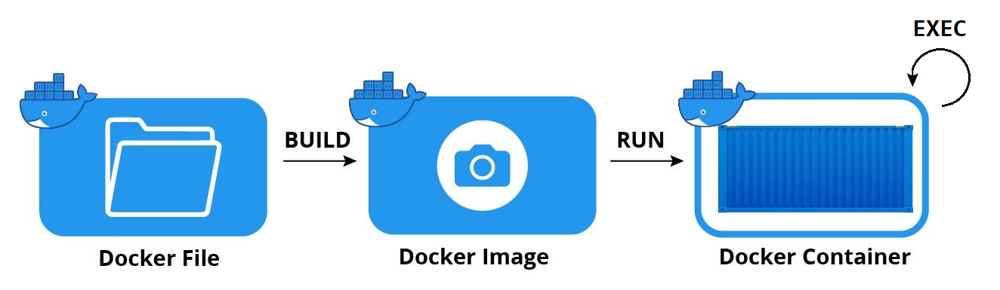
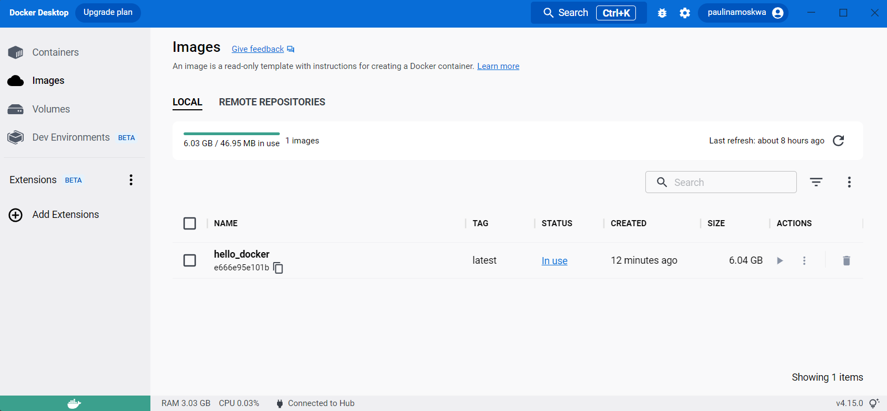
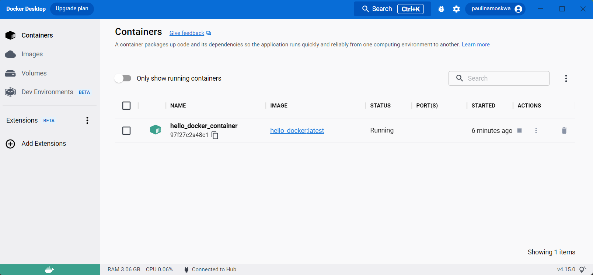
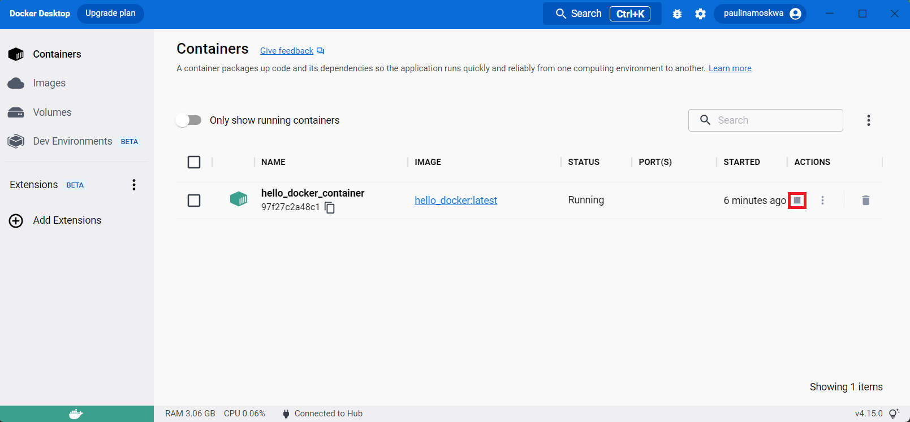
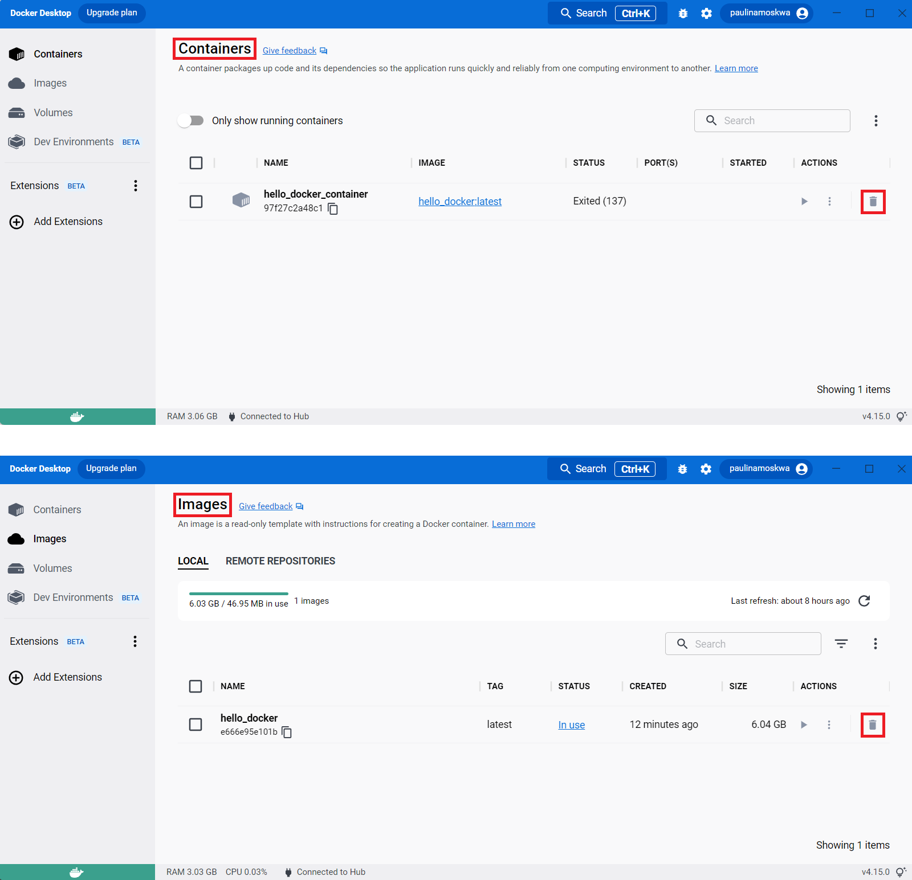
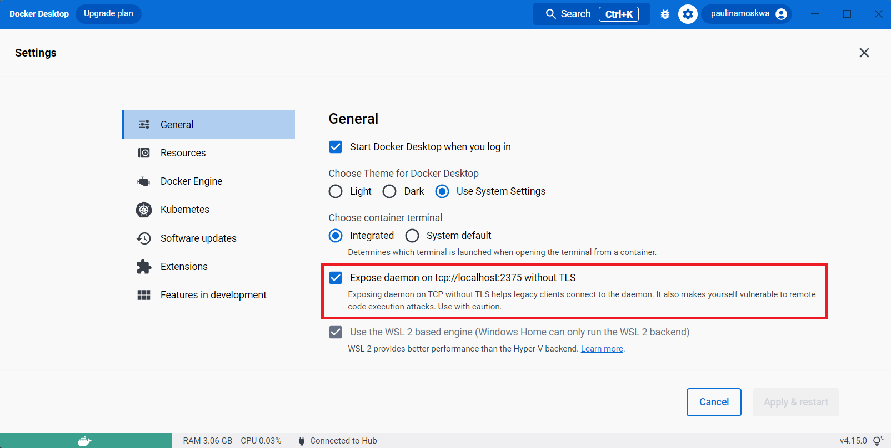

# Docker 101: A Step-by-Step Guide
[](https://opensource.org/licenses/MIT)
[](https://opensource.org/licenses/MIT)

Tutorial difficulty level: ✨ _made by a blonde, for blondes_ ✨
<p align="center">

</p>

## Docker in a Nutshell

Docker allows to create, build, and run containerized applications.
A container is a standalone package that includes everything an application
needs to run, such as code, libraries and dependencies.

To use Docker:

1. Create a `DockerFile`: this is a text file that contains instructions on how 
to build a Docker image for an application. The `DockerFile` specifies the base
image to use, the libraries and dependencies to install, and any additional 
customizations or configurations.

2. Build the Docker image. We can use the `docker build` command and specify the
path to the `DockerFile`. This will create a Docker image that includes all the
ecessary components.<br>
The basic syntax is:
```commandline
docker build -t <image-name> <path-to-folder-containing-Dockerfile>
```

Note. We will build the Docker image starting from a `DockerFile` which is
located in the same directory of the remaining code. However, it is possible to
create a Docker image, for example, starting from a Docker image url.<br>
The syntax remains unchanged:
```commandline
docker build -t <image-name> <url>
```
A practical example could be:
```commandline
docker build -t docker_firefox github.com/creack/docker-firefox
```
 
3. Run the Docker container. Starting from an image, to create a running Docker 
container we can use the `docker run` command, specifying both the name we want
to give to the container and the name of the Docker image.<br>
The basic syntax is:
```commandline
docker run -d --name=<container-name> <image-name> sleep infinity
```

4. Execute commands. Now that the container is created, and it is running, we can
execute commands in it using the `docker exec` command..<br>
The basic syntax is:
```commandline
docker exec <container-name> <command>
```

The overall schema is the following:
<p align="center">

</p>

## Docker Tutorial for this Repo

First of all, the `DockerFile`.
```dockerfile
FROM python:3.9
ADD main.py .

ADD requirements.txt /tmp/requirements.txt
RUN pip install -r /tmp/requirements.txt
```
The `FROM` line tells us the base image that we want to retrieve to build our
new image: in this case it is `python 3.9`.<br> 
The `ADD` line copies files from the first argument and adds them to the
container file system under the second argument path: in this case we copy
`main.py` to `.` directory. Moreover, we also copy the `requirements.txt` to
a `tmp` folder. In this way, it will be possible for Docker to access the list
of requirements and install them.<br>
The `RUN` line executes the given command.

Starting from this `DockerFile`, we build the image with the following syntax:
```commandline
docker build -t hello_docker .
```

We can check on Docker Desktop that the image is in fact created.
<p align="center">

</p>

Now that we have the Docker image, we create a running Docker container with
the following syntax:
```commandline
docker run -d --name=hello_docker_container hello_docker sleep infinity
```

We can check on Docker Desktop that the container is in fact created.
<p align="center">

</p>

Now everything is set, and we can finally run what we want inside the Docker
container. We run the script `main.py` with the following syntax:
```commandline
docker exec hello_docker_container python3 main.py
```

## Docker Extras
Once we are done with everything, we should stop the container from running.<br>
It is possible to do it from Docker Desktop:
<p align="center">

</p>

Or, we can do it from command line with the following syntax:
```commandline
docker stop <container-name>
```
In our specific case, this would be:
```commandline
docker stop hello_docker_container
```

-----------
If we don't need the container or the image, we can delete them both. <br>
Again, this is possible to be done from Docker Desktop:
<p align="center">

</p>

Or, we can do it from command line with the following syntax:
* To delete the container:
```commandline
docker rm <container-name>
```
In our specific case:
```commandline
docker rm hello_docker_container
```

* To delete the image:
```commandline
docker image rm <image-name>
```
In our specific case:
```commandline
docker image rm hello_docker
```

## Useful _semi_-Off-Topic
A good guide to [install Docker on Windows](https://www.youtube.com/watch?v=2ezNqqaSjq8&t=625s&ab_channel=TheCodeholic).

Moreover, in Docker Desktop settings, make sure to always have this checkbox checked:
<p align="center">

</p>
